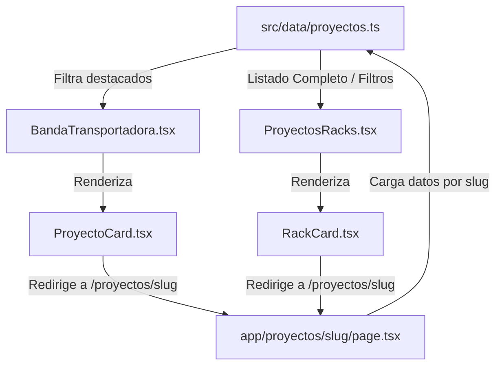

# IMPLEMENTATIONS-MORI-FUNCION
## Plan de Implementación: Funcionalidad de Tarjetas en el Apartado "Proyectos"

Este documento detalla el plan de diseño y desarrollo para que las tarjetas de proyectos del sitio web (tanto la **Banda Transportadora** de destacados como el **Catálogo en Rack**) sean interactivas y redirijan a una página de detalle dinámico basada en la estructura del prototipo/template (`template/proyecto.html`).

---

## 🎯 Descripción del Objetivo

Actualmente, las tarjetas en `/proyectos` se muestran de forma estática y no responden a clics del usuario. El objetivo es darles funcionalidad completa:
1. **Enlace Dinámico:** Vincular cada tarjeta a una ruta dinámica en Next.js (`/proyectos/[slug]`).
2. **Centralización de Datos:** Integrar los datos del carrusel de destacados (`BandaTransportadora.tsx`) con la base de datos principal en `src/data/proyectos.ts` para mantener la coherencia y eliminar datos duplicados.
3. **Página de Detalle Dinámico:** Crear una nueva página en Next.js (`src/app/proyectos/[slug]/page.tsx`) que reproduzca la estructura, diseño premium, tipografías y efectos visuales de `template/proyecto.html`.

---

## 🛠️ Arquitectura y Flujo de Datos



---

## 📝 Cambios Propuestos

### 1. Base de Datos Centralizada
#### [MODIFY] [proyectos.ts](file:///d:/Mis%20apps/dd/SupplyMentum-Landing-Page/frontend/src/data/proyectos.ts)
*   Definir la interfaz `ParticipanteProyecto` para el equipo participante.
*   Exportar e integrar el arreglo `equipoProyecto` idéntico al del template para mostrar los participantes genéricos del proyecto (o específicos si se decide en el futuro).
*   Asegurar que todas las fotos utilicen URLs deterministas de Picsum o recursos locales.

```typescript
export interface ParticipanteProyecto {
  name: string;
  role: string;
  img: string;
}

export const equipoProyecto: ParticipanteProyecto[] = [
  { name: 'Líder de proyecto', role: 'Lead', img: 'https://picsum.photos/seed/sm-pt-1/600/600' },
  { name: 'Analista 1', role: 'Operaciones', img: 'https://picsum.photos/seed/sm-pt-2/600/600' },
  { name: 'Analista 2', role: 'Consultoría', img: 'https://picsum.photos/seed/sm-pt-3/600/600' },
  { name: 'Analista 3', role: 'Marketing', img: 'https://picsum.photos/seed/sm-pt-4/600/600' },
];
```

---

### 2. Componentes de Tarjetas
#### [MODIFY] [ProyectoCard.tsx](file:///d:/Mis%20apps/dd/SupplyMentum-Landing-Page/frontend/src/components/proyectos/ProyectoCard.tsx)
*   Reemplazar la interfaz local `Proyecto` e importar `ProyectoData` de `@/data/proyectos`.
*   Cambiar las propiedades de la tarjeta para usar la base de datos unificada:
    *   `proyecto.title` $\rightarrow$ `proyecto.name`
    *   `proyecto.category` $\rightarrow$ `proyecto.area`
    *   `proyecto.description` $\rightarrow$ `proyecto.desc`
    *   `proyecto.imageUrl` $\rightarrow$ `proyecto.img`
*   Importar `Link` de `next/link` y envolver el contenedor principal para que sea clickable, manteniendo la transición CSS del hover y el efecto de escala.

#### [MODIFY] [BandaTransportadora.tsx](file:///d:/Mis%20apps/dd/SupplyMentum-Landing-Page/frontend/src/components/proyectos/BandaTransportadora.tsx)
*   Eliminar la constante local `proyectos` que contiene datos duplicados e inconsistentes.
*   Importar la lista de proyectos reales: `import { proyectos } from "@/data/proyectos"`.
*   Filtrar los proyectos que tengan la propiedad `destacado === true` para cargarlos dinámicamente en el carrusel infinito.

#### [MODIFY] [RackCard.tsx](file:///d:/Mis%20apps/dd/SupplyMentum-Landing-Page/frontend/src/components/proyectos/RackCard.tsx)
*   Importar `Link` de `next/link`.
*   Envolver todo el contenedor `<article>` de la tarjeta en un `<Link href={`/proyectos/${proyecto.slug}`}>` para habilitar la navegación a la vista de detalle.

---

### 3. Página de Detalle de Proyecto (Nueva Ruta)
#### [NEW] [page.tsx](file:///d:/Mis%20apps/dd/SupplyMentum-Landing-Page/frontend/src/app/proyectos/%5Bslug%5D/page.tsx)
*   Crear la carpeta `src/app/proyectos/[slug]` y el archivo `page.tsx` para Next.js 15.
*   Implementar `generateMetadata` de forma asíncrona para mejorar el SEO cargando el nombre y descripción del proyecto en la pestaña del navegador.
*   Implementar `ProyectoDetailPage` como componente de servidor asíncrono para leer el parámetro `slug`.
*   Buscar el proyecto en `proyectos.find(p => p.slug === slug)`. Si no existe, invocar `notFound()`.
*   **Estructura de la Página (basada en el template original):**
    1.  **Cabecera Hero (`page-hero`):**
        *   Fondo de pantalla con la imagen `proyecto.img` con filtros `grayscale(.5) brightness(.55) contrast(1.06)`.
        *   Capa de gradiente de marca (`radial-gradient` o lineal que funde a negro).
        *   Botón para regresar atrás: `Link` hacia `/proyectos` con efecto hover.
        *   Badge de Área (`proyecto.area`) y texto del Año (`proyecto.year`).
        *   Título principal (`proyecto.name`) usando la clase `.display` (`Archivo Black`).
        *   Descripción (`proyecto.desc`) usando la clase `.lede` (`Open Sans`).
    2.  **Sección de Participantes:**
        *   Título: "Participantes"
        *   Grilla (`grid grid-cols-1 sm:grid-cols-2 lg:grid-cols-4 gap-6`) que renderiza las tarjetas de los miembros de `equipoProyecto` con fotos circulares o cuadradas, nombres, roles y transiciones fluidas de hover.
    3.  **Galería del Proyecto:**
        *   Título: "Galería del proyecto"
        *   Grilla responsiva que muestre 3 imágenes seeded (`https://picsum.photos/seed/${proyecto.slug}-g${i}/900/700` para `i` de 1 a 3) aplicando los estilos de la galería del template (`grayscale` a color en hover y zoom sutil).
    4.  **Sección de Llamado a la Acción (CTA):**
        *   Título: "¿Quieres liderar el próximo?"
        *   Texto explicativo sobre la postulación de ideas.
        *   Botón de registro interactivo (`btn btn-primary`) que redirija a `/convocatoria`.

---

## 🔍 Plan de Verificación

### Pruebas Manuales
1.  **Navegación:**
    *   Hacer clic en cualquier tarjeta del carrusel de destacados (`BandaTransportadora.tsx`) y validar que redirija a `/proyectos/<slug>`.
    *   Hacer clic en cualquier tarjeta del catálogo inferior (`ProyectosRacks.tsx`) y validar que redirija a `/proyectos/<slug>`.
    *   Presionar el botón "← Todos los proyectos" en el detalle y verificar el regreso a la lista de proyectos.
2.  **Carga Dinámica:**
    *   Validar que la imagen, área, año, título y descripción cambien correctamente según el proyecto seleccionado.
    *   Validar que las imágenes de la galería correspondan a la semilla del proyecto específico (las fotos deben verse diferentes para cada proyecto).
3.  **Responsividad:**
    *   Probar la visualización del detalle en pantallas móviles (375px), tablets (768px) y desktops (1280px+).
4.  **SEO:**
    *   Verificar que el título del documento cambie a: `[Nombre del Proyecto] | SupplyMentum UNI` en la barra del navegador.
